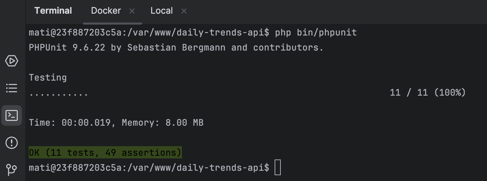

# Daily Trends API

## Docker

Se utiliza Docker como entorno de **desarrollo local**.

Para comenzar crea la red de Avantio (_recomendado_). Permitirá comunicar diferentes proyectos en un futuro.

```
docker network create avantio
```

Antes de construir tus contenedores, asegúrate de tener las variables de entorno `UNAME` y `UID` en tu archivo `.env`.

> En Linux o Mac puedes abrir el terminal y escribir `id` para conocer dichas variables.

A continuación, puedes hacer build:

```
docker compose build
```

No olvides agregar `-d` para que se ejecute en segundo plano:

```
docker compose up -d
```

Con el fin de facilitar el uso de la **CLI** de **Symfony** y evitar conflictos de permisos, cuando accedas al container
inicia sesión con `su` seguido del nombre de usuario que hayas especificado en el `UNAME`.

Por ejemplo:

```
docker exec -it server_daily_trends_api bash
```

Y a continuación:

```
su mati
```

Esto nos permitirá ejecutar comandos propios de la CLI de Symfony, como `maker` sin entrar en conflictos entre _root_ y
nuestro _usuario local_.

### Symfony

Se ha configurado **NGINX** para trabajar con el dominio local http://avantio.test:8027/.
> Asegúrate de añadir `127.0.0.1	avantio.test` en tu archivo `/etc/hosts` local.

### Mongo Express

Simplemente cambia el puerto (8081) y accede a http://avantio.test:8081/.

## Portada

Los últimos _Feeds_ en portada se renderizan con el motor de plantillas Twig y para darle un estilo más atractivo se ha
configurado Tailwindcss.


Instalar las dependencias:

```
npm install
```

Para compilar los estilos se debe ejecutar:

```
npm run build
```

## Diagrama

En líneas generales, al acceder a la Portada se buscan las noticias de los periódicos El Mundo
y El País, estos dos son los únicos que usan la técnica de scraping.

No obstante, la interface Newspaper también es implementada por Avantio News, este periódico
lista directamente de base de datos (sin scraping) las noticias agregadas por el usuario vía API.


## API

Con el fin de aportar valor a la API con una documentación y validación para hacer CRUD del Feed (Document - _Modelo_),
se ha optado por API Platform debido a su compatibilidad con Symfony/Doctrine (ODM).


Como se puede apreciar, mediante attributos en el propio Feed, podemos añadir validaciones garantizando la integridad y
seguridad de nuestro sistema.
En este caso, se ha decidido que de forma forzosa sea propiedad del periódico "Avantio News" todas las peticiones que se
realicen vía API.


Se lista igualmente ya que nuestra Factoría no discrimina si es un Newspaper por Scrape o añadido mediante API.
Por defecto, hemos agregado un límite de 15 noticias en Portada.

## Test

Con PHPUnit, se han realizado Test Unitarios del _"Core"_ del Sistema, es decir, los Feeds:




## Developer team backlog

- Autorizar a usuarios para el uso de la API
- Agregar un validador para el importador de noticias
- Añadir Test de Integración
- Añadir paginación y filtro de noticias
- **Importante**: añadir variables de entorno en Docker en caso de despliegue.